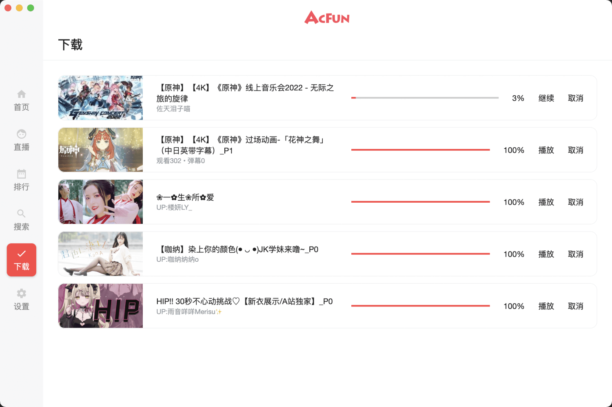

 

 
 

   

 

<h1>AcFun-Client-Multiplatform</h1>

这是一个旨在使用 Compose Multiplatform 技术来构建一个多平台的在线流媒体客户端, 同时支持 Android Phone，Android Pad,
Android TV, Windows, Mac OS, Linux。

## 下载

https://github.com/succlz123/AcFun-Client-Multiplatform/releases

- Linux 有需要的可以自行编译打包。
- Mac OS 拖动安装后，需要去系统-偏好设置-安全性与隐私里面允许打开。
- Windows 安装后没有桌面快捷方式，exe 文件在 C:\Program Files\AcFun 里。

## 功能

- 首页展示，分区内容展示，视频详情展示，UP主投稿视频查看。
- 视频播放，直播，弹幕 (简易弹幕-实验性质)，播放功能增强，变速等。
- 搜索，下载。
- Android Phone, Android Pad,Desktop 适配。

## 开发中功能

- 支持播放选集功能。
- Android TV 适配。
- DLNA 投屏。
- 番剧，文章区。

## 不同平台下展示

### 桌面和平板

 

### 手机

 

### 下载

 

### 播放和弹幕

 

